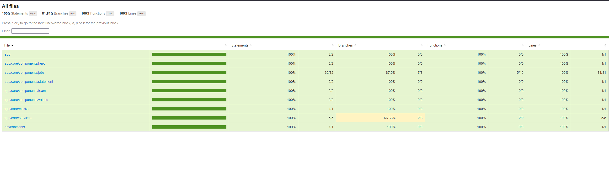
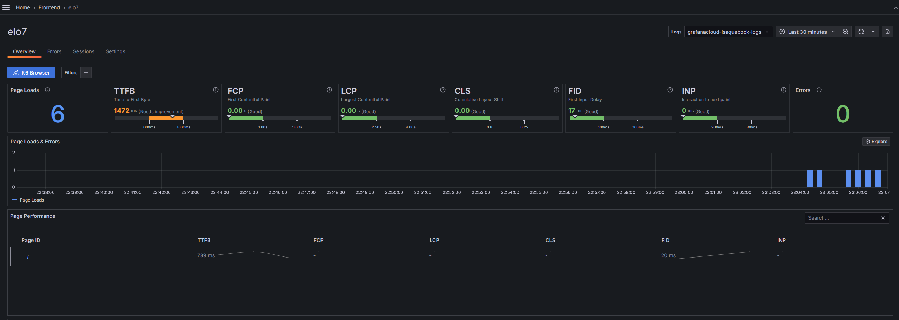

# 🚀 Landing Page de Vagas - Elo7

## 📄 Descrição
Este projeto consiste em uma landing page para visualização dinâmica de vagas de emprego.

## 🏃‍♂️ Executando o projeto

Para executar o projeto na sua máquina existem duas formas, mas antes certifique-se que você tem o projeto clonado em sua máquina.

    git clone git@github.com:isaquebock/elo7.git

### Executando pelo Docker
Para executar o projeto pelo docker, é simples, basta ter o Docker instalado na sua máquina e rodar o comando do docker na raiz do projeto *elo7*.

    RUN docker compose up --build

Você vai conseguir visualizar o projeto em _http://localhost_ 

### Executando local
Para executar local, primeiro certifique-se que você possui o Node.js (*LTS*) e o Angular CLI instalado.

Estando na raiz do projeto *elo7* abra 2 termineis e rode um comando em cada terminal

#### *Comando 1:* 
Terminal BASH

    cd frontend && ng serve

Terminal SHELL

    cd frontend; ng serve;

#### *Comando 2:* 
Terminal BASH

    cd backend && npm run dev

Terminal SHELL

    cd backend; npm run dev;

Você vai conseguir visualizar o projeto em _http://localhost:4200_ 

## 🛠️ Testes
### Testes unitários

Para executar os testes unitários, primeiro certifique-se que você possui o Node.js (*LTS*) e o Angular CLI instalado.

Clone o projeto *elo7*. 

    git clone git@github.com:isaquebock/elo7.git

Execute o comando de testes e veja no terminal cada teste sendo executado. 

    ng test
    
Para visualizar a cobertura de testes, execute: 

    ng test --no-watch --code-coverage

Já existe um coverage disponível, com o projeto clonado abra **[COVERAGE](./frontend/coverage/frontend/index.html)**

### Testes automatizados (*e2e*)

Para executar os testes automatizados, primeiro certifique-se que você possui o Node.js (*LTS*) instalado.

*Aqui suponho que você já possui o projeto clonado no seu computador.*

Antes de executar os testes automatizados, dê uma olhada nos cenários de testes propostos: **[CENÁRIOS DE TESTES](./frontend/docs/scenarios.md)**

Com o projeto rodando, execute o comando abaixo para iniciar os testes automatizados 

    npm run cypress:web
   
## 👀 Oservabilidade
Para observar a aplicação foi implementado Grafana Faro, direto no index.html, nele é possivel pegar insights através de métricas de perfomance e monitoramento.

